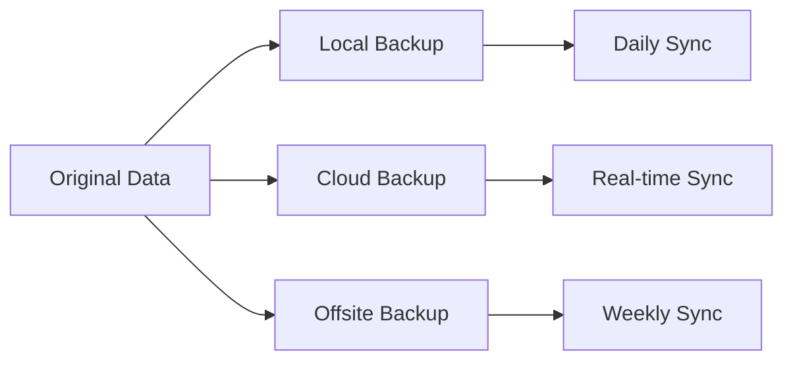

# Sistem Backup dan Disaster Recovery untuk Bisnis di Surabaya

**Data adalah aset paling berharga** dalam bisnis modern. Kehilangan data dapat menyebabkan kerugian finansial hingga miliaran rupiah dan merusak reputasi perusahaan. Sebagai penyedia **jasa IT support Surabaya**, kami telah membantu puluhan bisnis memulihkan data dari berbagai bencana.

## 📊 Statistik Kehilangan Data di Indonesia

### **Fakta Mengkhawatirkan:**
- **60% bisnis** yang kehilangan data tutup dalam 6 bulan
- **Rp 2,3 miliar** kerugian rata-rata per incident
- **94% perusahaan** tidak pernah pulih sepenuhnya dari data loss
- **72% UMKM** tidak memiliki sistem backup yang memadai

### **Penyebab Kehilangan Data:**

| Penyebab | Persentase | Dampak Bisnis |
|----------|------------|---------------|
| Hardware Failure | 40% | Complete data loss |
| Human Error | 29% | Partial data corruption |
| Malware/Ransomware | 18% | System encryption |
| Natural Disaster | 8% | Infrastructure damage |
| Theft | 5% | Physical device loss |

## 🏗️ Strategi Backup 3-2-1 Rule

### **Aturan Emas Backup:**
- **3 Copy** data (1 original + 2 backup)
- **2 Media** berbeda (local + cloud)
- **1 Offsite** backup (geografis terpisah)



### **Implementation Example:**
```bash
# Local backup script
#!/bin/bash
SOURCE_DIR="/var/www/html"
BACKUP_DIR="/backup/daily"
DATE=$(date +%Y%m%d_%H%M%S)

# Create compressed backup
tar -czf $BACKUP_DIR/backup_$DATE.tar.gz $SOURCE_DIR

# Keep only last 7 days
find $BACKUP_DIR -name "backup_*.tar.gz" -mtime +7 -delete

# Upload to cloud
rclone sync $BACKUP_DIR remote:backup/daily
```

## 💾 Jenis-Jenis Backup

### **1. Full Backup**
**Karakteristik:**
- Backup semua data
- Waktu restore tercepat
- Storage requirement tinggi
- Ideal untuk data critical

**Implementasi:**
```sql
-- Database full backup
BACKUP DATABASE CompanyDB 
TO DISK = 'C:\Backup\CompanyDB_Full.bak'
WITH FORMAT, COMPRESSION;
```

### **2. Incremental Backup**
**Keunggulan:**
- Storage efficient
- Backup time minimal
- Network bandwidth rendah

**Rsync Implementation:**
```bash
# Incremental backup dengan rsync
rsync -av --delete --backup --backup-dir=/backup/incremental/$(date +%Y%m%d) \
    /data/ /backup/current/
```

### **3. Differential Backup**
**Balance antara Full dan Incremental:**
```powershell
# Windows differential backup
wbadmin start backup -backupTarget:E: -include:C: -allCritical -quiet
```

## 🏢 Solusi Backup Berdasarkan Jenis Bisnis

### **Retail & Toko (Surabaya Pusat)**

**Data Critical:**
- Transaksi penjualan
- Database customer
- Inventory data
- Financial records

**Recommended Solution:**
```yaml
Backup Strategy:
  POS Data:
    - Real-time sync ke cloud
    - Local backup setiap 4 jam
    - Daily full backup
  
  Financial Data:
    - End-of-day backup
    - Weekly offsite backup
    - Monthly archive
  
  Tools:
    - Veeam Backup & Replication
    - AWS S3 for cloud storage
    - Local NAS for quick restore
```

**Budget Planning:**
- **Basic Package**: Rp 3-5 juta (Local NAS + Cloud)
- **Professional**: Rp 8-12 juta (Automated + Monitoring)
- **Enterprise**: Rp 15-25 juta (Real-time + Geo-redundancy)

### **Kantor Corporate (Surabaya Timur & Barat)**

**Enterprise Backup Architecture:**
```bash
# VMware vSphere backup
# Backup VMs with snapshots
vim-cmd vmsvc/snapshot.create vmid "backup_snapshot" "Daily backup"

# SQL Server backup strategy
EXEC sp_addumpdevice 'disk', 'CompanyDB_Backup',
'\\BackupServer\SQLBackups\CompanyDB.bak'

# Exchange Server backup
New-MailboxExportRequest -Mailbox user@company.com -FilePath \\backup\pst\user.pst
```

**Disaster Recovery Planning:**
- **RTO (Recovery Time Objective)**: 4 jam
- **RPO (Recovery Point Objective)**: 1 jam
- **Hot Site**: Backup datacenter ready
- **Cold Site**: Manual recovery process

### **Pabrik & Manufaktur (Sidoarjo)**

**Industrial Data Protection:**
```yaml
SCADA Backup:
  - Real-time database replication
  - Configuration backup daily
  - Historical data archiving
  
PLC Programming:
  - Version control system
  - Automated backup to repository
  - Change management process

Production Data:
  - Continuous data logging
  - Batch processing backup
  - Quality control records
```

## ☁️ Cloud Backup Solutions

### **Public Cloud Options:**

| Provider | Storage Cost | Features | Local Presence |
|----------|--------------|----------|----------------|
| **AWS S3** | $0.023/GB/month | Glacier for archiving | Jakarta region |
| **Google Cloud** | $0.020/GB/month | Near-line storage | Jakarta region |
| **Microsoft Azure** | $0.024/GB/month | Hot/Cool/Archive tiers | Jakarta region |
| **Alibaba Cloud** | $0.019/GB/month | OSS with lifecycle | Jakarta region |

### **Hybrid Cloud Setup:**
```bash
# Rclone configuration for multi-cloud
[aws-s3]
type = s3
provider = AWS
access_key_id = YOUR_ACCESS_KEY
secret_access_key = YOUR_SECRET_KEY
region = ap-southeast-1

[google-cloud]
type = google cloud storage
project_number = YOUR_PROJECT_ID
service_account_file = /path/to/service-account.json

# Sync to multiple clouds
rclone sync /data/ aws-s3:bucket/data/
rclone sync /data/ google-cloud:bucket/data/
```

### **Local Cloud Providers:**
- **Telkom Sigma** - Data center lokal Jakarta
- **Biznet Gio** - Multi-region Indonesia
- **Indosat Ooredoo** - Enterprise cloud solutions

## 🚨 Disaster Recovery Planning

### **Business Impact Analysis:**
```yaml
Critical Systems Priority:
  Tier 1 (0-4 hours):
    - Email system
    - Financial applications
    - Customer database
  
  Tier 2 (4-24 hours):
    - ERP system
    - File servers
    - Backup systems
  
  Tier 3 (24-72 hours):
    - Archive data
    - Development systems
    - Training environments
```

### **Recovery Procedures:**

**Step 1: Assessment & Communication**
```bash
# Automated disaster detection
#!/bin/bash
CRITICAL_SERVICES=("database" "web" "email")

for service in "${CRITICAL_SERVICES[@]}"; do
    if ! systemctl is-active --quiet $service; then
        # Send alert
        curl -X POST "https://api.telegram.org/botTOKEN/sendMessage" \
             -d chat_id=CHAT_ID \
             -d text="ALERT: $service is down!"
        
        # Log incident
        echo "$(date): $service failed" >> /var/log/disaster.log
    fi
done
```

**Step 2: Data Recovery**
```sql
-- SQL Server point-in-time recovery
RESTORE DATABASE CompanyDB FROM DISK = 'C:\Backup\CompanyDB_Full.bak'
WITH REPLACE, NORECOVERY;

RESTORE LOG CompanyDB FROM DISK = 'C:\Backup\CompanyDB_Log.trn'
WITH STOPAT = '2024-12-20 14:30:00';
```

**Step 3: System Validation**
```python
# Automated recovery testing
import subprocess
import requests
import mysql.connector

def test_database_connection():
    try:
        conn = mysql.connector.connect(
            host='localhost',
            user='backup_user',
            password='password',
            database='company_db'
        )
        return conn.is_connected()
    except:
        return False

def test_web_application():
    try:
        response = requests.get('http://localhost/health-check')
        return response.status_code == 200
    except:
        return False

# Run recovery tests
tests = [
    ("Database", test_database_connection),
    ("Web App", test_web_application)
]

for name, test_func in tests:
    result = "PASS" if test_func() else "FAIL"
    print(f"{name}: {result}")
```

## 🔧 Tools & Software Recommendations

### **Enterprise Solutions:**
- **Veeam Backup & Replication** - Rp 15-25 juta/tahun
- **Commvault Complete Backup** - Rp 20-35 juta/tahun
- **Acronis Cyber Backup** - Rp 8-15 juta/tahun

### **SMB Solutions:**
- **Cobian Backup** - Gratis, Windows-based
- **Duplicati** - Open source, cross-platform
- **AOMEI Backupper** - Rp 500K-2 juta

### **Cloud-Native:**
```bash
# AWS CLI backup automation
aws s3 sync /data/ s3://company-backup/$(date +%Y/%m/%d)/

# Google Cloud backup
gsutil -m rsync -r -d /data/ gs://company-backup/

# Azure backup
azcopy sync /data/ "https://account.blob.core.windows.net/backup"
```

## 📋 Testing & Monitoring

### **Regular Testing Schedule:**
```yaml
Daily Tests:
  - Backup completion verification
  - Storage space monitoring
  - Network connectivity check

Weekly Tests:
  - Sample file restoration
  - Database consistency check
  - Backup integrity verification

Monthly Tests:
  - Full system recovery simulation
  - Disaster recovery procedures
  - Documentation review
```

### **Monitoring Script:**
```python
#!/usr/bin/env python3
import os
import subprocess
import smtplib
from datetime import datetime, timedelta

def check_backup_age(backup_path, max_age_hours=24):
    """Check if backup is within acceptable age"""
    if not os.path.exists(backup_path):
        return False
    
    file_time = datetime.fromtimestamp(os.path.getmtime(backup_path))
    age = datetime.now() - file_time
    
    return age.total_seconds() < (max_age_hours * 3600)

def send_alert(message):
    """Send email alert"""
    # Email configuration
    smtp_server = "smtp.gmail.com"
    smtp_port = 587
    sender_email = "backup@company.com"
    sender_password = "app_password"
    recipient_email = "admin@company.com"
    
    # Send email
    server = smtplib.SMTP(smtp_server, smtp_port)
    server.starttls()
    server.login(sender_email, sender_password)
    server.sendmail(sender_email, recipient_email, message)
    server.quit()

# Check critical backups
critical_backups = [
    "/backup/database/daily.sql",
    "/backup/files/documents.tar.gz",
    "/backup/system/system_image.img"
]

for backup_file in critical_backups:
    if not check_backup_age(backup_file):
        alert_msg = f"BACKUP ALERT: {backup_file} is outdated or missing!"
        send_alert(alert_msg)
        print(alert_msg)
```

## 💰 ROI Calculation untuk Backup Investment

### **Cost of Downtime:**
```python
# Downtime cost calculator
def calculate_downtime_cost(
    revenue_per_hour,
    employees_affected,
    avg_hourly_wage,
    downtime_hours,
    reputation_impact_percentage=10
):
    # Direct revenue loss
    revenue_loss = revenue_per_hour * downtime_hours
    
    # Employee productivity loss  
    productivity_loss = employees_affected * avg_hourly_wage * downtime_hours
    
    # Reputation impact
    reputation_loss = revenue_loss * (reputation_impact_percentage / 100)
    
    total_cost = revenue_loss + productivity_loss + reputation_loss
    return total_cost

# Example for medium business in Surabaya
cost = calculate_downtime_cost(
    revenue_per_hour=5_000_000,  # Rp 5 juta/jam
    employees_affected=20,
    avg_hourly_wage=50_000,      # Rp 50K/jam
    downtime_hours=8,            # 8 jam downtime
    reputation_impact_percentage=15
)

print(f"Total downtime cost: Rp {cost:,}")
# Output: Total downtime cost: Rp 47,000,000
```

### **Backup Investment vs Risk:**
- **Backup System Cost**: Rp 25 juta/tahun
- **Single Downtime Cost**: Rp 47 juta (8 jam)
- **ROI**: 188% dalam satu incident

## 🎯 Layanan Backup & Recovery kotacom.id

### **Mengapa Pilih kotacom.id?**

✅ **24/7 Monitoring** - Automated backup verification
✅ **Multi-Platform Support** - Windows, Linux, VMware
✅ **Local & Cloud** - Hybrid backup solutions
✅ **Fast Recovery** - Average RTO < 4 jam
✅ **Compliance Ready** - ISO 27001, SOX, GDPR

### **Paket Backup & Recovery:**

| Paket | Harga/Bulan | Storage | Features |
|-------|-------------|---------|----------|
| **Basic** | Rp 2-3 juta | 100GB | Daily backup, 30-day retention |
| **Professional** | Rp 5-8 juta | 500GB | Real-time sync, 90-day retention |
| **Enterprise** | Rp 12-20 juta | 2TB+ | Disaster recovery, unlimited retention |

### **Coverage Area:**
- **Surabaya**: All districts (response < 2 jam)
- **Sidoarjo**: Industrial areas (response < 3 jam)
- **Gresik & Mojokerto**: Extended coverage (response < 4 jam)

## 🚨 Emergency Data Recovery

**Data Hilang? Jangan Panik!**

📱 **Emergency Hotline**: [085799520350](https://wa.me/62085799520350?text=EMERGENCY:%20Data%20loss%20incident!)

⏰ **Response Time**: 30 menit (24/7)

🔧 **On-site Service**: 1-2 jam (area Surabaya)

---

**Jangan tunggu sampai kehilangan data!**

Lindungi bisnis Anda dengan sistem backup dan disaster recovery yang handal dari kotacom.id.

📞 **Konsultasi Gratis**: [085799520350](https://wa.me/62085799520350?text=Halo,%20saya%20tertarik%20dengan%20layanan%20backup%20dan%20disaster%20recovery)

*Artikel ini disusun berdasarkan pengalaman memulihkan data untuk 150+ klien di Surabaya dan sekitarnya.*

**Keywords**: backup data Surabaya, disaster recovery Surabaya, sistem backup bisnis, data protection Sidoarjo, jasa backup recovery