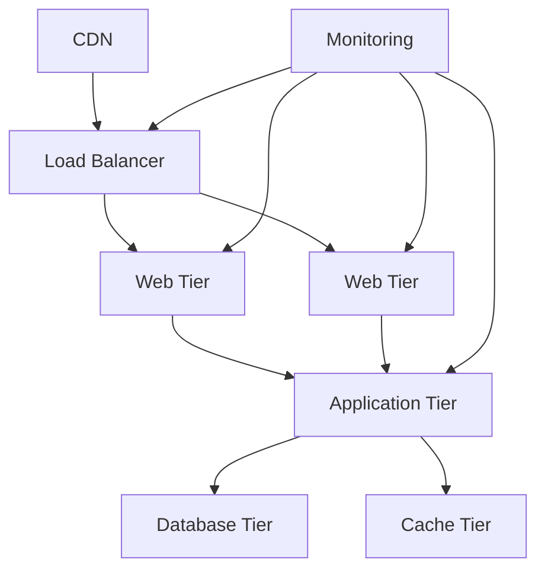

# Perencanaan Infrastruktur IT untuk Pertumbuhan Bisnis di Surabaya

**Infrastruktur IT yang tepat** adalah fondasi kesuksesan bisnis modern. Tanpa perencanaan yang matang, bisnis akan menghadapi bottleneck teknologi yang menghambat pertumbuhan. Sebagai **konsultan IT infrastructure Surabaya**, kami telah membantu 200+ bisnis merancang infrastruktur yang scalable dan future-proof.

## 📈 Tantangan Infrastruktur IT di Era Digital

### **Statistik Pertumbuhan Digital Indonesia:**
- **78% UMKM** berencana digitalisasi dalam 2 tahun
- **156% peningkatan** traffic online pasca-pandemi
- **Rp 845 triliun** potensi ekonomi digital Indonesia 2030
- **65% bisnis** mengalami kendala infrastruktur IT

### **Masalah Umum Infrastruktur IT:**

| Masalah | Impact Bisnis | Solusi |
|---------|---------------|---------|
| **Scalability Issues** | Growth terhambat | Modular architecture |
| **Single Point of Failure** | Business continuity risk | Redundancy planning |
| **Legacy Systems** | Innovation bottleneck | Migration strategy |
| **Security Vulnerabilities** | Data breach risk | Security by design |
| **High Operational Cost** | Profit margin berkurang | Cloud optimization |

## 🏗️ Framework Perencanaan Infrastruktur IT

### **1. Business Assessment & Requirements**

**Current State Analysis:**
```yaml
Business Analysis:
  Company Size: 50 employees
  Annual Revenue: Rp 15 miliar
  Growth Target: 100% in 2 years
  Critical Applications:
    - ERP System
    - E-commerce Platform
    - Customer Database
    - Email & Collaboration
  
Current Infrastructure:
  Servers: 2 physical servers (5 years old)
  Network: 100 Mbps internet, basic switch
  Storage: Local storage, no backup
  Security: Basic firewall, outdated antivirus
  
Pain Points:
  - Slow application response
  - Frequent system downtime
  - Limited remote work capability
  - Manual backup process
  - No disaster recovery plan
```

**Future State Vision:**
```yaml
Target Infrastructure (2 Years):
  Scalability: Support 100+ users
  Performance: <2 second response time
  Availability: 99.9% uptime
  Security: Multi-layer protection
  Mobility: Full remote work support
  Disaster Recovery: RTO < 4 hours
  
Business Drivers:
  - Market expansion (Jakarta, Bali)
  - Product diversification
  - Digital transformation
  - Compliance requirements
  - Cost optimization
```

### **2. Architecture Design Principles**

**Scalable Architecture Pattern:**


**Technology Stack Selection:**
```yaml
Frontend Tier:
  Web Server: Nginx/Apache
  CDN: CloudFlare/AWS CloudFront
  SSL: Let's Encrypt/Commercial

Application Tier:
  Framework: .NET Core/Java Spring/Node.js
  Container: Docker + Kubernetes
  API Gateway: Kong/AWS API Gateway

Data Tier:
  Primary DB: PostgreSQL/SQL Server
  Cache: Redis/Memcached
  Search: Elasticsearch
  File Storage: MinIO/AWS S3

Infrastructure:
  Cloud: AWS/Azure/GCP
  Monitoring: Prometheus + Grafana
  CI/CD: GitLab/Jenkins
  Backup: Veeam/AWS Backup
```

## 🏢 Infrastruktur Berdasarkan Ukuran Bisnis

### **Startup & Small Business (5-20 Karyawan)**

**Minimal Viable Infrastructure:**
```yaml
Budget: Rp 50-150 juta
Timeline: 2-4 minggu

Core Components:
  Cloud Server: 
    - 4 vCPU, 8GB RAM, 200GB SSD
    - Auto-scaling capability
    - Managed database service
  
  Networking:
    - Business internet 100/50 Mbps
    - Managed WiFi (Ubiquiti/Cisco)
    - VPN for remote access
  
  Security:
    - Cloud-native firewall
    - Endpoint protection
    - Email security
    - Basic monitoring
  
  Productivity:
    - Google Workspace/Microsoft 365
    - Cloud storage & collaboration
    - Video conferencing
    - Project management tools
```

**Implementation Roadmap:**
```yaml
Week 1-2: Assessment & Planning
  - Business requirements gathering
  - Current infrastructure audit
  - Technology selection
  - Vendor evaluation

Week 3-4: Implementation
  - Cloud infrastructure setup
  - Application migration
  - Security configuration
  - User training

Week 5-6: Testing & Optimization
  - Performance testing
  - Security validation
  - User acceptance testing
  - Documentation
```

### **Medium Business (20-100 Karyawan)**

**Enterprise-Ready Infrastructure:**
```yaml
Budget: Rp 200-500 juta
Timeline: 6-12 minggu

Hybrid Cloud Architecture:
  On-Premises:
    - VMware vSphere cluster (3 hosts)
    - SAN storage 10TB
    - Redundant network switches
    - UPS & generator backup
  
  Public Cloud:
    - AWS/Azure for web applications
    - CDN for global content delivery
    - Backup & disaster recovery
    - Development & testing environments
  
Advanced Features:
  - Active Directory integration
  - Single Sign-On (SSO)
  - Multi-factor authentication
  - Network segmentation (VLAN)
  - 24/7 monitoring & alerting
  - Automated backup & recovery
```

**Technology Architecture:**
```bash
# Infrastructure as Code (Terraform)
resource "aws_vpc" "main" {
  cidr_block           = "10.0.0.0/16"
  enable_dns_hostnames = true
  enable_dns_support   = true
  
  tags = {
    Name = "company-vpc"
  }
}

resource "aws_subnet" "web" {
  count             = 2
  vpc_id            = aws_vpc.main.id
  cidr_block        = "10.0.${count.index + 1}.0/24"
  availability_zone = data.aws_availability_zones.available.names[count.index]
  
  tags = {
    Name = "web-subnet-${count.index + 1}"
  }
}

resource "aws_autoscaling_group" "web" {
  name                = "web-asg"
  vpc_zone_identifier = aws_subnet.web[*].id
  target_group_arns   = [aws_lb_target_group.web.arn]
  health_check_type   = "ELB"
  
  min_size         = 2
  max_size         = 10
  desired_capacity = 3
  
  launch_template {
    id      = aws_launch_template.web.id
    version = "$Latest"
  }
}
```

### **Large Enterprise (100+ Karyawan)**

**Mission-Critical Infrastructure:**
```yaml
Budget: Rp 1-5 miliar
Timeline: 3-6 bulan

Multi-Site Architecture:
  Primary Data Center (Surabaya):
    - Tier 3 facility with 99.982% uptime
    - Redundant power & cooling
    - 24/7 on-site support
    - Disaster recovery site ready
  
  Secondary Site (Jakarta):
    - Hot standby for critical systems
    - Real-time data replication
    - Automatic failover capability
  
  Edge Locations:
    - Branch office connectivity
    - Local caching & processing
    - Satellite internet backup
  
Enterprise Services:
  - Enterprise Resource Planning (SAP/Oracle)
  - Customer Relationship Management
  - Business Intelligence & Analytics
  - Document Management System
  - Enterprise Communication Platform
```

## ☁️ Cloud Strategy & Migration

### **Cloud Adoption Framework:**

```yaml
Phase 1: Cloud Readiness Assessment
  Duration: 2-4 weeks
  Activities:
    - Application portfolio analysis
    - Dependency mapping
    - Cost-benefit analysis
    - Risk assessment
    - Migration strategy development

Phase 2: Pilot Migration
  Duration: 4-8 weeks
  Activities:
    - Select low-risk applications
    - Set up cloud landing zone
    - Implement security controls
    - Establish monitoring & logging
    - Validate migration process

Phase 3: Bulk Migration
  Duration: 3-12 months
  Activities:
    - Wave-based migration approach
    - Application modernization
    - Data migration & validation
    - User training & support
    - Performance optimization

Phase 4: Cloud Optimization
  Duration: Ongoing
  Activities:
    - Cost optimization
    - Performance tuning
    - Security enhancement
    - Governance implementation
    - Innovation enablement
```

### **Multi-Cloud Strategy:**
```yaml
Primary Cloud (AWS): 60%
  - Production workloads
  - Database services
  - Content delivery
  - AI/ML services

Secondary Cloud (Azure): 30%
  - Office 365 integration
  - Windows-based applications
  - Backup & disaster recovery
  - Development environments

Tertiary Cloud (GCP): 10%
  - Analytics & Big Data
  - Machine learning
  - Specialized services
  - Cost optimization
```

## 🔒 Security Architecture Planning

### **Zero Trust Security Model:**

```yaml
Identity & Access Management:
  - Multi-factor authentication (MFA)
  - Privileged access management (PAM)
  - Single sign-on (SSO)
  - Identity governance

Network Security:
  - Micro-segmentation
  - Network access control (NAC)
  - Intrusion detection/prevention (IDS/IPS)
  - Web application firewall (WAF)

Endpoint Protection:
  - Endpoint detection & response (EDR)
  - Mobile device management (MDM)
  - Application whitelisting
  - Vulnerability management

Data Protection:
  - Data classification & labeling
  - Encryption at rest & in transit
  - Data loss prevention (DLP)
  - Backup & recovery
```

### **Compliance Framework:**
```yaml
Regulatory Requirements:
  Indonesia:
    - UU ITE (Informasi dan Transaksi Elektronik)
    - Peraturan OJK (Financial Services)
    - PP 71/2019 (Personal Data Protection)
  
  International:
    - ISO 27001 (Information Security)
    - SOC 2 Type II (Service Organization Control)
    - GDPR (General Data Protection Regulation)
    - PCI DSS (Payment Card Industry)

Implementation Roadmap:
  Quarter 1:
    - Gap analysis & risk assessment
    - Policy & procedure development
    - Security awareness training
    - Technical control implementation
  
  Quarter 2:
    - Internal audit & testing
    - Vendor assessment
    - Incident response planning
    - Continuous monitoring setup
  
  Quarter 3:
    - External audit preparation
    - Remediation activities
    - Documentation review
    - Certification process
```

## 📊 Capacity Planning & Performance

### **Performance Monitoring Framework:**

```python
# Infrastructure monitoring script
import psutil
import requests
import json
from datetime import datetime

class InfrastructureMonitor:
    def __init__(self):
        self.metrics = {}
        self.thresholds = {
            'cpu_usage': 80,
            'memory_usage': 85,
            'disk_usage': 90,
            'response_time': 2000  # milliseconds
        }
    
    def collect_system_metrics(self):
        """Collect system performance metrics"""
        self.metrics['timestamp'] = datetime.now().isoformat()
        self.metrics['cpu_usage'] = psutil.cpu_percent(interval=1)
        self.metrics['memory_usage'] = psutil.virtual_memory().percent
        self.metrics['disk_usage'] = psutil.disk_usage('/').percent
        
        # Network metrics
        net_io = psutil.net_io_counters()
        self.metrics['network_sent'] = net_io.bytes_sent
        self.metrics['network_recv'] = net_io.bytes_recv
        
        return self.metrics
    
    def test_application_performance(self, url):
        """Test application response time"""
        try:
            start_time = datetime.now()
            response = requests.get(url, timeout=10)
            end_time = datetime.now()
            
            response_time = (end_time - start_time).total_seconds() * 1000
            self.metrics['response_time'] = response_time
            self.metrics['http_status'] = response.status_code
            
        except Exception as e:
            self.metrics['response_time'] = 999999
            self.metrics['error'] = str(e)
    
    def check_thresholds(self):
        """Check if metrics exceed thresholds"""
        alerts = []
        
        for metric, threshold in self.thresholds.items():
            if metric in self.metrics and self.metrics[metric] > threshold:
                alerts.append({
                    'metric': metric,
                    'value': self.metrics[metric],
                    'threshold': threshold,
                    'severity': 'high' if self.metrics[metric] > threshold * 1.2 else 'medium'
                })
        
        return alerts
    
    def send_alerts(self, alerts):
        """Send alerts to monitoring system"""
        for alert in alerts:
            webhook_url = "https://hooks.slack.com/services/YOUR/WEBHOOK/URL"
            message = {
                "text": f"🚨 Alert: {alert['metric']} is {alert['value']}% (threshold: {alert['threshold']}%)"
            }
            requests.post(webhook_url, json=message)

# Usage example
monitor = InfrastructureMonitor()
monitor.collect_system_metrics()
monitor.test_application_performance('https://company.com/api/health')
alerts = monitor.check_thresholds()

if alerts:
    monitor.send_alerts(alerts)
```

### **Capacity Planning Calculator:**
```python
def calculate_infrastructure_capacity(current_users, growth_rate, performance_target):
    """
    Calculate required infrastructure capacity for business growth
    """
    # Current baseline metrics
    current_metrics = {
        'cpu_cores': 8,
        'memory_gb': 32,
        'storage_gb': 1000,
        'network_mbps': 100,
        'concurrent_users': current_users
    }
    
    # Performance per user ratios
    per_user_requirements = {
        'cpu_cores': 0.1,
        'memory_gb': 0.5,
        'storage_gb': 2,
        'network_mbps': 0.5
    }
    
    # Calculate future requirements
    future_users = current_users * (1 + growth_rate)
    
    future_requirements = {}
    for resource, per_user in per_user_requirements.items():
        base_requirement = future_users * per_user
        # Add 20% buffer for peak usage
        future_requirements[resource] = base_requirement * 1.2
    
    # Calculate scaling factor
    scaling_factors = {}
    for resource in future_requirements:
        current_capacity = current_metrics[resource]
        required_capacity = future_requirements[resource]
        scaling_factors[resource] = required_capacity / current_capacity
    
    return {
        'current_users': current_users,
        'future_users': future_users,
        'current_capacity': current_metrics,
        'required_capacity': future_requirements,
        'scaling_factors': scaling_factors,
        'investment_priority': sorted(scaling_factors.items(), key=lambda x: x[1], reverse=True)
    }

# Example: Company with 50 users planning 100% growth
result = calculate_infrastructure_capacity(
    current_users=50,
    growth_rate=1.0,  # 100% growth
    performance_target=2  # 2 second response time
)

print(f"Current users: {result['current_users']}")
print(f"Future users: {result['future_users']}")
print(f"Required scaling:")
for resource, factor in result['scaling_factors'].items():
    print(f"  {resource}: {factor:.1f}x")
```

## 💰 ROI & Budget Planning

### **Total Cost of Ownership (TCO) Analysis:**

```python
def calculate_infrastructure_tco(scenario, years=5):
    """
    Calculate 5-year TCO for different infrastructure scenarios
    """
    scenarios = {
        'on_premises': {
            'initial_capex': 500_000_000,  # Rp 500 juta
            'annual_opex': 150_000_000,    # Rp 150 juta/tahun
            'maintenance': 50_000_000,     # Rp 50 juta/tahun
            'power_cooling': 30_000_000,   # Rp 30 juta/tahun
            'staff_cost': 200_000_000,     # Rp 200 juta/tahun
            'refresh_cost': 200_000_000    # Year 3 refresh
        },
        'hybrid_cloud': {
            'initial_capex': 200_000_000,  # Rp 200 juta
            'annual_opex': 120_000_000,    # Rp 120 juta/tahun
            'cloud_cost': 180_000_000,     # Rp 180 juta/tahun
            'maintenance': 30_000_000,     # Rp 30 juta/tahun
            'staff_cost': 150_000_000,     # Rp 150 juta/tahun
            'refresh_cost': 100_000_000    # Year 4 refresh
        },
        'full_cloud': {
            'initial_capex': 50_000_000,   # Rp 50 juta
            'annual_opex': 80_000_000,     # Rp 80 juta/tahun
            'cloud_cost': 300_000_000,     # Rp 300 juta/tahun
            'maintenance': 10_000_000,     # Rp 10 juta/tahun
            'staff_cost': 100_000_000,     # Rp 100 juta/tahun
            'refresh_cost': 0              # No refresh needed
        }
    }
    
    config = scenarios[scenario]
    total_cost = config['initial_capex']
    
    for year in range(1, years + 1):
        annual_cost = (
            config['annual_opex'] +
            config.get('cloud_cost', 0) +
            config['maintenance'] +
            config['staff_cost']
        )
        
        # Add refresh cost in specified year
        if year == 3 and scenario == 'on_premises':
            annual_cost += config['refresh_cost']
        elif year == 4 and scenario == 'hybrid_cloud':
            annual_cost += config['refresh_cost']
        
        total_cost += annual_cost
    
    return {
        'scenario': scenario,
        'total_cost': total_cost,
        'annual_average': total_cost / years,
        'initial_investment': config['initial_capex']
    }

# Compare all scenarios
scenarios = ['on_premises', 'hybrid_cloud', 'full_cloud']
comparison = []

for scenario in scenarios:
    result = calculate_infrastructure_tco(scenario)
    comparison.append(result)
    print(f"{scenario.title()}: Rp {result['total_cost']:,} (5 years)")

# Find most cost-effective option
best_option = min(comparison, key=lambda x: x['total_cost'])
print(f"\nMost cost-effective: {best_option['scenario']} - Rp {best_option['total_cost']:,}")
```

## 🎯 Implementation Roadmap

### **Phase-Based Implementation:**

```yaml
Phase 1: Foundation (Months 1-3)
  Objectives:
    - Establish core infrastructure
    - Implement basic security
    - Enable remote work capability
  
  Deliverables:
    - Cloud infrastructure setup
    - Network security implementation
    - User productivity tools deployment
    - Basic monitoring & backup
  
  Budget: 30% of total
  Success Metrics:
    - 99.5% uptime achieved
    - All users can work remotely
    - Zero security incidents

Phase 2: Optimization (Months 4-6)
  Objectives:
    - Improve performance & reliability
    - Enhance security posture
    - Implement automation
  
  Deliverables:
    - Performance optimization
    - Advanced security controls
    - Automated monitoring & alerting
    - Disaster recovery testing
  
  Budget: 40% of total
  Success Metrics:
    - 99.9% uptime achieved
    - <2 second response time
    - Successful DR test

Phase 3: Innovation (Months 7-12)
  Objectives:
    - Enable digital transformation
    - Implement advanced analytics
    - Prepare for future growth
  
  Deliverables:
    - AI/ML platform deployment
    - Advanced analytics capabilities
    - API management platform
    - IoT infrastructure
  
  Budget: 30% of total
  Success Metrics:
    - 50% process automation
    - Real-time business insights
    - Scalability for 2x growth
```

## 🏆 Layanan Infrastructure Planning kotacom.id

### **Mengapa Pilih kotacom.id?**

✅ **Certified Architects** - AWS, Azure, VMware certified
✅ **Local Expertise** - Understanding Surabaya business landscape
✅ **Proven Track Record** - 200+ successful implementations
✅ **End-to-End Service** - From planning to ongoing support
✅ **Cost Optimization** - Average 30% cost reduction

### **Layanan Infrastructure Planning:**

| Service | Duration | Price Range | Deliverables |
|---------|----------|-------------|--------------|
| **IT Assessment** | 2-4 weeks | Rp 15-25 juta | Current state analysis, recommendations |
| **Architecture Design** | 4-8 weeks | Rp 30-50 juta | Detailed design, migration plan |
| **Implementation** | 3-12 months | Rp 200M-2M | Full infrastructure deployment |
| **Managed Services** | Ongoing | Rp 15-50 juta/bulan | 24/7 monitoring & support |

### **Industry Expertise:**
- **Manufacturing**: SCADA, MES, industrial networks
- **Retail**: POS systems, e-commerce platforms
- **Healthcare**: HIPAA compliance, patient data systems
- **Finance**: PCI DSS, core banking systems
- **Education**: Learning management systems, campus networks

## 📞 Konsultasi Infrastructure Planning

**Ready to Transform Your IT Infrastructure?**

🎯 **Free Assessment**: [085799520350](https://wa.me/62085799520350?text=Halo,%20saya%20tertarik%20dengan%20layanan%20IT%20infrastructure%20planning)

📊 **Strategy Workshop**: 4-hour workshop untuk define your IT roadmap

📋 **ROI Calculator**: Free tool untuk calculate infrastructure investment

📧 **Expert Consultation**: planning@kotacom.id

---

**Don't let outdated infrastructure limit your business growth!**

Partner dengan kotacom.id untuk merancang infrastruktur IT yang scalable, secure, dan future-ready.

📱 **WhatsApp**: [085799520350](https://wa.me/62085799520350?text=Halo,%20saya%20butuh%20konsultasi%20IT%20infrastructure%20planning%20untuk%20bisnis%20di%20Surabaya)

*Artikel ini disusun berdasarkan pengalaman merancang infrastruktur IT untuk berbagai industri di Surabaya dan Indonesia.*

**Keywords**: IT infrastructure planning Surabaya, konsultan infrastruktur IT, perencanaan teknologi bisnis, scalable IT architecture, digital transformation Surabaya