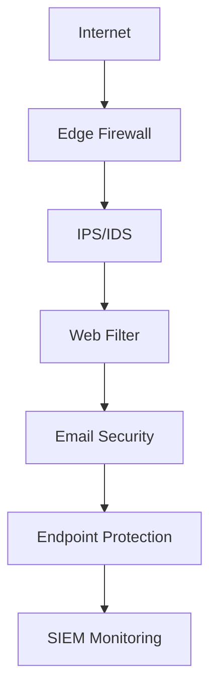

# Sistem Keamanan Jaringan untuk Bisnis di Surabaya: Panduan Lengkap

Di era digital ini, **keamanan jaringan** menjadi prioritas utama bagi setiap bisnis di Surabaya. Dengan meningkatnya serangan cyber, bisnis yang tidak memiliki sistem keamanan yang memadai berisiko kehilangan data, uang, dan kepercayaan pelanggan.

## 🚨 Ancaman Cybersecurity di Indonesia

### **Statistik Serangan Cyber 2024:**
- **156% peningkatan** serangan ransomware
- **73% UMKM** tidak memiliki sistem keamanan memadai
- **Rp 34 miliar** kerugian rata-rata per incident
- **Surabaya** masuk 3 besar kota dengan serangan terbanyak

### **Jenis Serangan Paling Umum:**

| Jenis Serangan | Persentase | Dampak Bisnis |
|----------------|------------|---------------|
| Phishing Email | 42% | Data breach, financial loss |
| Ransomware | 28% | System lockdown, data loss |
| DDoS Attack | 18% | Website down, revenue loss |
| Malware | 12% | System corruption, data theft |

## 🛡️ Komponen Sistem Keamanan Jaringan

### **1. Firewall - Benteng Pertama**

**Hardware Firewall Recommended:**
```bash
# Konfigurasi basic firewall rules
iptables -A INPUT -p tcp --dport 22 -j ACCEPT
iptables -A INPUT -p tcp --dport 80 -j ACCEPT  
iptables -A INPUT -p tcp --dport 443 -j ACCEPT
iptables -A INPUT -j DROP
```

**Top Firewall Brands untuk UMKM:**
- **SonicWall TZ370** - Rp 4,5 juta
- **Fortinet FortiGate 40F** - Rp 3,8 juta
- **pfSense** - Open source (gratis)

### **2. Antivirus & Anti-Malware**

**Enterprise Solutions:**
- **Kaspersky Endpoint Security** - Rp 150K/user/tahun
- **Bitdefender GravityZone** - Rp 200K/user/tahun
- **Windows Defender ATP** - Include di Office 365

**Konfigurasi Optimal:**
```powershell
# Enable Windows Defender via PowerShell
Set-MpPreference -DisableRealtimeMonitoring $false
Set-MpPreference -SubmitSamplesConsent SendAllSamples
Update-MpSignature
```

### **3. VPN untuk Remote Work**

**Setup OpenVPN Server:**
```bash
# Install OpenVPN di Ubuntu
sudo apt update
sudo apt install openvpn easy-rsa

# Generate certificates
make-cadir ~/openvpn-ca
cd ~/openvpn-ca
source vars
./clean-all
./build-ca
```

**Commercial VPN Solutions:**
- **NordLayer** - Rp 100K/user/bulan
- **ExpressVPN Business** - Rp 150K/user/bulan
- **Cisco AnyConnect** - Rp 200K/user/bulan

## 🏢 Keamanan Berdasarkan Jenis Bisnis

### **Retail & Toko (Surabaya Pusat)**

**Ancaman Khusus:**
- POS system hack
- Credit card skimming
- Customer data breach

**Solusi Security:**
```yaml
Security Stack:
  - PCI DSS compliant POS
  - Network segmentation
  - CCTV dengan AI detection
  - Encrypted payment gateway
```

**Recommended Setup:**
- **Firewall**: SonicWall TZ270
- **POS Security**: Verifone encryption
- **Network**: Separate VLAN untuk POS
- **Monitoring**: 24/7 SOC service

### **Kantor Corporate (Surabaya Timur & Barat)**

**Ancaman Khusus:**
- Email phishing
- Insider threats
- Data exfiltration
- Business email compromise

**Multi-Layer Security:**


**Budget Planning:**
| Komponen | Harga | Keterangan |
|----------|-------|------------|
| Enterprise Firewall | Rp 15-25 juta | FortiGate 100F |
| Email Security | Rp 50K/user/bulan | Microsoft Defender |
| Endpoint Protection | Rp 100K/user/bulan | CrowdStrike |
| SIEM Solution | Rp 10-20 juta/bulan | Splunk/QRadar |

### **Pabrik & Manufaktur (Sidoarjo)**

**Industrial Cybersecurity:**
- **OT Network Security** - Operational Technology
- **SCADA Protection** - Industrial control systems
- **Air-gapped Networks** - Isolated critical systems

**Specialized Solutions:**
```bash
# Industrial firewall rules
# Separate IT and OT networks
VLAN 10: IT Network (192.168.10.0/24)
VLAN 20: OT Network (192.168.20.0/24)
VLAN 30: DMZ (192.168.30.0/24)

# Block inter-VLAN communication except specific ports
```

## 🔧 Implementasi Step-by-Step

### **Phase 1: Assessment & Planning (Week 1-2)**

**Network Security Audit Checklist:**
- [ ] Inventory semua devices
- [ ] Scan vulnerabilities
- [ ] Review current policies
- [ ] Risk assessment
- [ ] Compliance requirements

**Tools untuk Assessment:**
```bash
# Network scanning
nmap -sS -O target_network

# Vulnerability scanning
nessus --scan-policy="Full Scan" target_ip

# Port scanning
masscan -p1-65535 target_range --rate=1000
```

### **Phase 2: Infrastructure Setup (Week 3-4)**

**1. Firewall Configuration:**
```bash
# Basic security rules
# Block all incoming except specific ports
iptables -P INPUT DROP
iptables -P FORWARD DROP
iptables -P OUTPUT ACCEPT

# Allow established connections
iptables -A INPUT -m state --state ESTABLISHED,RELATED -j ACCEPT

# Allow specific services
iptables -A INPUT -p tcp --dport 443 -j ACCEPT  # HTTPS
iptables -A INPUT -p tcp --dport 80 -j ACCEPT   # HTTP
iptables -A INPUT -p tcp --dport 22 -s trusted_ip -j ACCEPT  # SSH
```

**2. Network Segmentation:**
```yaml
Network Design:
  Management VLAN: 192.168.1.0/24
  User VLAN: 192.168.10.0/24
  Server VLAN: 192.168.20.0/24
  Guest VLAN: 192.168.30.0/24
  IoT VLAN: 192.168.40.0/24
```

### **Phase 3: Endpoint Protection (Week 5-6)**

**Deployment Script:**
```powershell
# Mass deployment via PowerShell
$computers = Get-Content "computers.txt"
foreach ($computer in $computers) {
    # Install antivirus
    Invoke-Command -ComputerName $computer -ScriptBlock {
        Start-Process msiexec.exe -ArgumentList "/i \\server\share\antivirus.msi /quiet" -Wait
    }
    
    # Configure Windows Defender
    Set-MpPreference -ComputerName $computer -DisableRealtimeMonitoring $false
}
```

## 📊 Monitoring & Incident Response

### **SIEM Implementation**

**Open Source SIEM (Budget-Friendly):**
```bash
# Install ELK Stack
# Elasticsearch
wget https://artifacts.elastic.co/downloads/elasticsearch/elasticsearch-8.0.0-linux-x86_64.tar.gz

# Logstash configuration
input {
  syslog {
    port => 514
  }
}
filter {
  if [program] == "iptables" {
    grok {
      match => { "message" => "%{IPTABLESLOG}" }
    }
  }
}
output {
  elasticsearch {
    hosts => ["localhost:9200"]
  }
}
```

**Commercial SIEM:**
- **Splunk Enterprise** - Rp 50 juta/tahun
- **QRadar SIEM** - Rp 30 juta/tahun
- **Microsoft Sentinel** - Rp 5K/GB/bulan

### **Incident Response Plan**

**Response Time Targets:**
- **Critical**: 15 menit
- **High**: 1 jam  
- **Medium**: 4 jam
- **Low**: 24 jam

**Escalation Matrix:**
```yaml
Level 1: SOC Analyst
  - Initial triage
  - Basic containment
  - Escalate if needed

Level 2: Security Engineer  
  - Deep analysis
  - Advanced containment
  - Recovery planning

Level 3: CISO/Security Manager
  - Strategic decisions
  - External communication
  - Business impact assessment
```

## 💰 Budget Planning untuk UMKM

### **Paket Keamanan Dasar (Rp 10-15 juta)**
- Firewall hardware basic
- Antivirus untuk 10 PC
- Basic monitoring
- Monthly security update

### **Paket Professional (Rp 25-40 juta)**
- Enterprise firewall
- Advanced threat protection
- VPN untuk remote work
- 24/7 monitoring
- Incident response

### **Paket Enterprise (Rp 50-100 juta+)**
- Multi-layer security
- SIEM implementation
- Dedicated SOC
- Compliance support
- Advanced threat hunting

## 🚀 Layanan Cybersecurity kotacom.id

### **Mengapa Pilih kotacom.id untuk Keamanan Jaringan?**

✅ **Certified Security Experts** (CISSP, CEH, GCIH)
✅ **24/7 SOC Monitoring** 
✅ **Compliance Ready** (ISO 27001, PCI DSS)
✅ **Local Support** Surabaya-Sidoarjo
✅ **Incident Response < 15 menit**

### **Layanan Cybersecurity:**

| Service | Description | Price Range |
|---------|-------------|-------------|
| Security Assessment | Vulnerability scan, penetration test | Rp 15-25 juta |
| Firewall Setup | Configuration, monitoring | Rp 5-10 juta |
| SOC Service | 24/7 monitoring, incident response | Rp 8-15 juta/bulan |
| Compliance Audit | ISO 27001, PCI DSS preparation | Rp 20-35 juta |

### **Emergency Incident Response**

**Cyber Attack? Hubungi Sekarang:**

🚨 **Emergency Hotline**: [085799520350](https://wa.me/62085799520350?text=EMERGENCY:%20Cyber%20attack%20detected!)

📧 **Security Team**: security@kotacom.id

⏰ **Response Time**: 15 menit (24/7)

## 📋 Security Checklist untuk Bisnis

### **Daily Tasks:**
- [ ] Monitor security alerts
- [ ] Check system logs
- [ ] Verify backup completion
- [ ] Update threat intelligence

### **Weekly Tasks:**
- [ ] Review firewall logs
- [ ] Update security patches
- [ ] Test incident response
- [ ] Security awareness training

### **Monthly Tasks:**
- [ ] Vulnerability assessment
- [ ] Policy review
- [ ] Compliance check
- [ ] Security metrics report

## 🎯 Next Steps

1. **Free Security Assessment** - Hubungi kotacom.id
2. **Risk Analysis** - Identifikasi vulnerability
3. **Implementation Plan** - Step-by-step deployment
4. **Training & Support** - Ensure proper adoption

---

**Jangan tunggu sampai terjadi serangan cyber!** 

Lindungi bisnis Anda sekarang dengan konsultasi gratis dari ahli cybersecurity kotacom.id.

📱 **WhatsApp**: [085799520350](https://wa.me/62085799520350?text=Halo,%20saya%20tertarik%20dengan%20layanan%20cybersecurity%20untuk%20bisnis%20di%20Surabaya)

*Artikel ini disusun berdasarkan best practices internasional dan pengalaman melindungi 100+ bisnis di Surabaya.*

**Keywords**: cybersecurity Surabaya, keamanan jaringan bisnis, firewall Surabaya, IT security Sidoarjo, sistem keamanan komputer