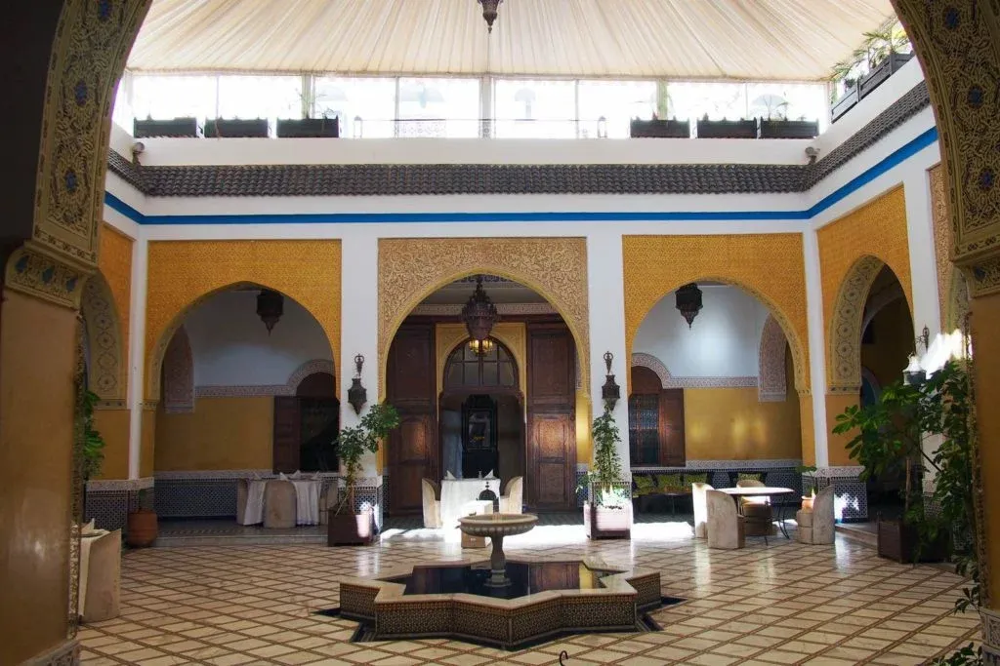
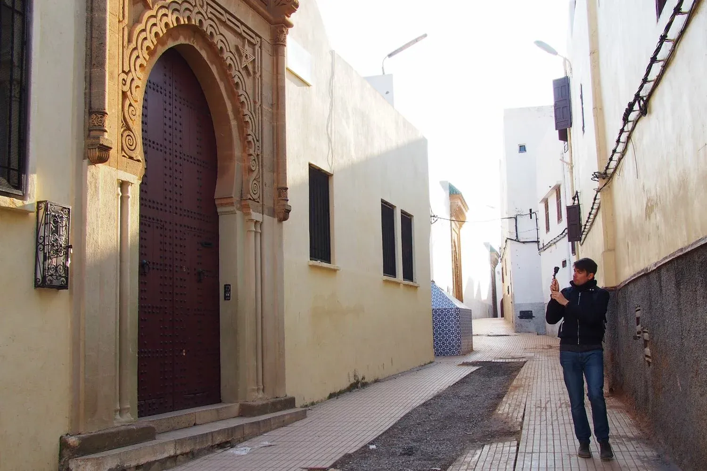
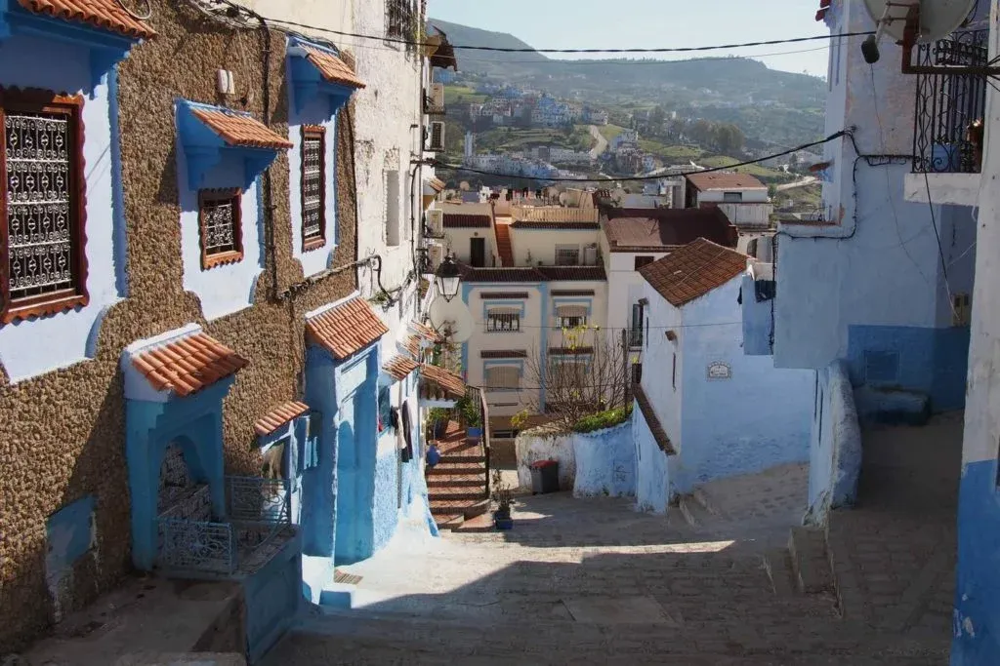
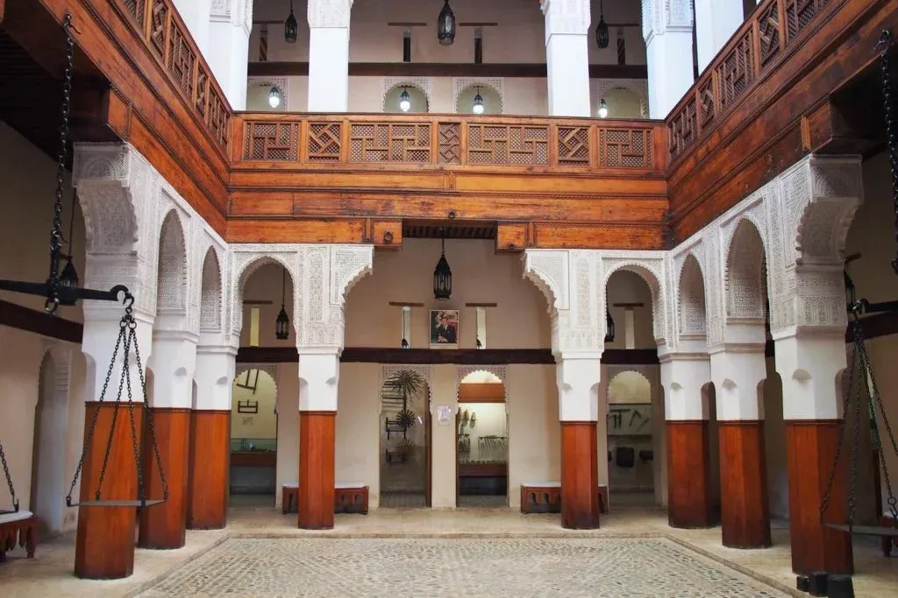
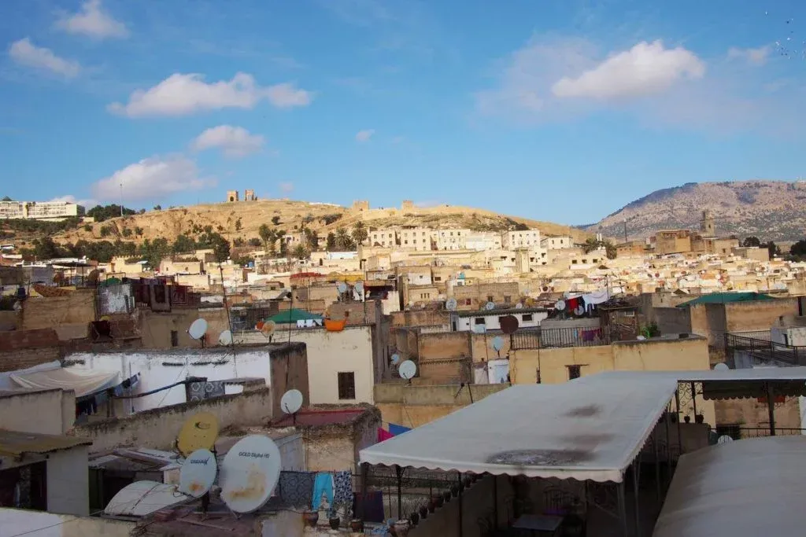
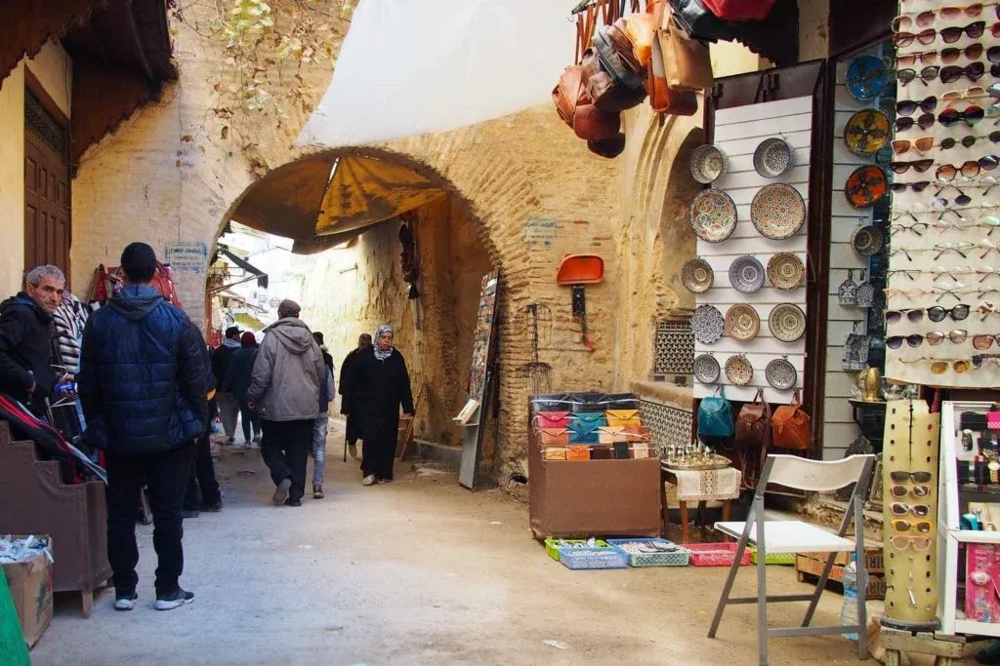

In this ten day Morocco itinerary, we’ll be visiting Meknes, Moulay Idriss, Sale, Rabat, Chefchaouen (via Tangiers) and Fes. Ten days is the perfect length of time for visiting Morocco, especially for first time visitors who want to get a taste of the country’s many highlights.

This itinerary is based on a real trip that we embarked upon and all the details are based on our actual experiences. We found the pace of the trip to be perfect for us, but if you like a slower pace, do feel free to add some extra nights in some of the cities.

This post contains affiliate links. Find out more in our [Privacy Policy](https://giveback.guide/privacy).

## Your 10 day Morocco itinerary in full detail

Your 10 day Morocco itinerary starts here. Let’s get into the detail on how you can make this trip happen.

[Open this itinerary on Stippl](https://www.stippl.io/heretotravel/trip/Morocco?utm_medium=website&utm_source=heretotravel&utm_campaign=creator_trips) to see a map and to start planning your own trip.

### Day 1: Arrival in Fes and onwards to Meknes

Upon arrival at Fes airport, there are a couple of things we advise you do before leaving the terminal.

#### Get some cash

Firstly, if you haven’t got any Moroccan Dirham, you can get some at the airport as you’ll be needing it. You can either use the currency exchange booths (they can exchange foreign cash or you can use a credit/debit card) or, if you have a zero fee debit or credit card, use an ATM. There are plenty available in the terminal.

#### Get a Sim card

Once you have claimed your baggage and made sure you have plenty of cash, you might want to consider getting a sim card for your mobile phone. Beyond baggage reclaim in the arrivals hall is a small kiosk that sells newspapers, magazines, tobacco and sim cards. You will likely pay a little more than you should, but staff in the shop will set the sim up for you on the spot and the sim will be working almost instantly. You can of course buy a sim from a dedicated mobile operator shop further into your trip, in which case you might save a little money.

#### Get a taxi

Fes Airport is not connected to any public transport, so you will have to have arranged your own transfer in advance or you’ll need to utilise a taxi.

There are two options in terms of taxis and one is definitely more favourable than the other.

The best option is to use the taxi rank that is immediately outside the terminal. Prices are fixed and you’ll find a big list of destinations and their respective prices on a sign adjacent to the queue. Taxis that service the queue are modern, air-conditioned and come with seat belts.

If, like us, you take too long in the terminal and there are no waiting taxis when you approach the taxi rank, you’ll need to deal with the unofficial taxi touts who linger outside. They’ll want to overcharge you, but be firm and use the list of prices on the sign to ensure you don’t overpay. Don’t be afraid to say no and walk away – it works a treat! After some haggling, we paid the advertised price to our destination. The taxi itself was definitely showing signs of age, and had no air-conditioning or seat belts, but it got us to our hotel in good time.

****Bonus tip:**** The route to Meknes includes a payable toll road. Your driver may ask you to pay the toll either at the toll booth or upon arrival at your destination. It is not your responsibility to pay the toll (it should be covered by your fare), so politely refuse if you’re asked.

#### Arrival in Meknes

In this itinerary, we’re heading to the nearby city of Meknes. It might seem strange to arrive in Fes, only to immediately leave, but don’t worry. We will be revisiting Fes further into the trip.

There are plenty of accommodation options in Meknes. [We stayed at Palais Didi](https://go.skimresources.com/?id=85974X1563631&xs=1&url=https%3A%2F%2Fwww.booking.com%2Fhotel%2Fma%2Fpalais-didi.en-gb.html), a beautiful family-run riad that’s a short walk away from the centre. The rooms are large and comfortable and the rooftop is well worth visiting to help get your bearings. The included breakfasts are very generous (vegetarian, but not vegan), though you’ll want to wrap up warm during breakfast time if you’re visiting in the Winter months – there’s no heating in the central courtyard).

Once you’ve settled into your room, you can explore the city a bit. We wandered over to Ladhim Square and enjoyed a Moroccan mint tea whilst people watching at one of the cafes.

For dinner, head to [Ya Hala](https://maps.app.goo.gl/MdRKDkx4DL3VwNfV7), a tiny family run eatery, for traditional Moroccan cuisine. Bookings are essential.

<iframe width="200" height="113" src="https://www.youtube.com/embed/u3tQ5_yfY34?feature=oembed" frameborder="0" allow="accelerometer; autoplay; clipboard-write; encrypted-media; gyroscope; picture-in-picture; web-share" referrerpolicy="strict-origin-when-cross-origin" allowfullscreen title="Discovering Moulay Idriss With a Local | 🇲🇦 MOROCCO"></iframe>

### Day 2: Moulay Idriss and Volubilis

Today, we’re heading to the town of Moulay Idriss and the nearby ancient city of [Volubilis](https://whc.unesco.org/en/list/836/).

We’ll be getting there by Grand Taxi (45-50 mins), which you can catch at the [taxi rank on Rue Talda](https://goo.gl/maps/ycYPfR4pPPdWJr9y6) (you can either walk from your accommodation or catch a Petite Taxi from Ladhim Square). Prices are fixed and taxis leave once all seven seats have been filled. Taxis leave the rank to various destinations, so ask around and someone will point you in the right place.

We booked a tour with a local, starting from [Dar Zerhoune hostel](https://go.skimresources.com/?id=85974X1563631&xs=1&url=https%3A%2F%2Fwww.booking.com%2Fhotel%2Fma%2Fdar-zerhoune.en-gb.html) (watch the video above to see how we got on on this tour). Finding the hostel is certainly tricky, so you might want to ask a local (you may well be offered help when you get out of the taxi). Expect to give a small tip to anyone who shows you the way.

<iframe width="200" height="113" src="https://www.youtube.com/embed/6Nezj3ZhQBw?feature=oembed" frameborder="0" allow="accelerometer; autoplay; clipboard-write; encrypted-media; gyroscope; picture-in-picture; web-share" referrerpolicy="strict-origin-when-cross-origin" allowfullscreen title="Walking to Volubilis | 🇲🇦 MOROCCO | Amazing Ancient Roman City"></iframe>

After the tour, you can get a taxi or bus to Volublis, but we really recommend you walk along the upper mountain road (see video above). The walk is very easy and provided you use an app like Google Maps, finding Volubilis is simple.

To get back to Meknes, your only option is to get a taxi from outside the entrance to Volubilis. Do haggle over the price, but expect to pay a fairly hefty fare.

### Day 3: Meknes to Salé & Rabat

We’re leaving Meknes and heading to Salé, a city that is immediately adjacent to Rabat, Morocco’s capital. We chose to stay in Salé because accommodation was noticeably cheaper in Salé than in Rabat. Getting between the two cities is very easy, so it seemed like a no brainer, especially considering the deal we got on our room.

#### Getting to Salé by train

To get to Salé, we’re taking the train. You can [buy train tickets in advance online](https://www.oncf-voyages.ma/) or in person at the station right before the departure time. Journey times varies, but for us, it was just under 2 hours including an easy change of trains in Kenitra. The trains themselves were decent and efficient. Upgrading to first class is recommended for a more comfortable journey, especially since the price difference between the classes is nominal.

The train departs from Gare de Meknes and you may need to catch a Petite Taxi (from Ladhim Square) to get there.

#### Arriving in Salé/Rabat

Upon arrival at Salé train station, you’ll almost certainly need to walk the rest of the way to your accommodation as the medina is pedestrianised.

If you’ve chosen to stay in Rabat, you can stay on the train as it terminates further down the line in Rabat itself. Alternatively, you may want to change at Salé station to the [excellent tram network](https://www.tram-way.ma/) – the tram stop is immediately outside the station and tickets can be purchased from vending machines on the platform.

We chose to stay at [Riad Marlinea](https://go.skimresources.com/?id=85974X1563631&xs=1&url=https%3A%2F%2Fwww.booking.com%2Fhotel%2Fma%2Friad-marlinea.en-gb.html), a fantastic family-run riad right in the heart of the medina. Staff were very friendly and accommodating and our room was lovely (it even had a hot tub).

#### Getting to Rabat

In the evening, we decided to head to Rabat for wander around and to have dinner. To get there, there is a very useful water taxi service operated by rowing boats that crosses the Bou Regreg river, the stretch of water that separates Salé from Rabat. On the Rabat side of the river are various food stalls and amusements for children.

To get back to Salé, we recommend taking the tram to Salé station and walking back from there. Bear in mind that Rabat’s Petite taxis won’t cross the river to Salé, meaning your only other option is a Grand Taxi.

****Read More:**** [Morocco: 24 Essential Things To Know Before You Go](https://blog.giveback.guide/morocco-travel-guide/)

<iframe width="200" height="113" src="https://www.youtube.com/embed/Nm_uBmtQvDA?feature=oembed" frameborder="0" allow="accelerometer; autoplay; clipboard-write; encrypted-media; gyroscope; picture-in-picture; web-share" referrerpolicy="strict-origin-when-cross-origin" allowfullscreen title="Kasbah des Oudayas, Rabat | 🇲🇦 MOROCCO | Walk from Salé"></iframe>

### Day 4: Explore Rabat

Use this day to explore Rabat. We’ll leave it down to you as to what you do with your time, but here are some of the places that we visited:

- [Kasbah des Oudayas](https://en.wikipedia.org/wiki/Kasbah_of_the_Udayas), a beautiful UNESCO World Heritage site (watch the video above to see why we recommend a visit here)
- Andalusian Garden
- [Mohammed VI Museum of Modern Art](http://www.museemohammed6.ma/)
- Shopping in the Medina

### Day 5: Chefchaouen via High Speed Train to Tangier

Today is quite a big travel day. If you prefer, you can add an extra night in Tangier to the itinerary to break up the journey. In reality, while it might seem like quite a lot of travel, it’s really a pretty easy journey and it’s quick thanks to _Al Boraq_, Morocco’s high-speed rail line.

If you chose to stay in central Rabat, you’ll need to get to _Rabat-Agdal_ station to catch a direct _Al Boraq_ high-speed service to Tangier. If, like us, you’re staying in Salé, you can get a local train from Salé station to Kenitra station and then pick-up the high-speed train from there.

The journey from Salé to Kenitra should take around 20 minutes. If you’ve booked a first class ticket (and you should if you can afford to, the price difference is very small), you can access the first class lounge at Kenitra (though it’s nothing particuarly special and drinks are rationed to one per person). If you have time before your departure from Kenitra, you can walk around the town for a bit, though it’s a fairly normal town and there’s not much to see within walking distance of the station.

When [booking your train ticket](https://www.oncf-voyages.ma/), you can reserve a seat. Bear in mind, ONCF seem to book seats in numerical order starting with seat 1 in coach 1, so you might find that this particular coach is rather crowded. Curious whether the rest of the train was as busy, I wandered through to coach 2 and found it to be completely empty. If you’d like some extra space on your journey, do go to see whether you can find some spare seats elsewhere.

Just a quick mention of the Al Boraq service – it’s excellent in almost every way. We couldn’t fault it, especially considering how low the fares are.

#### Arrival in Tangier

Upon arrival at Tangier, you have three choices; you can explore a little (though do bear in mind that there are no luggage storage facilities at the train station), you can head to your accommodation if you’re staying the night, or you can continue your journey to Chefchaouen.

The second leg of the journey to Chefcaouen will be by Grand Taxi and you’ll need to head to the new [Gare Routiere (Bus Station)](https://goo.gl/maps/DbD3B9fQHEBNdJeg7) just outside the city near the airport to catch one.

To get to Gare Routiere, you can catch a Petite Taxi or a Grand Taxi (the cheaper option). If you’re catching a Petite Taxi, you can get one right outside the station, though you might be able to negotiate a better price if you walk a little way from the station and flag a cab from the street.

Grand Taxi have fixed prices, but only depart from certain ranks, which you’ll either need to walk to our get a Petite Taxi to.

#### Gare Routiere (Bus Station)

Once you arrive at Gare Routiere, you’ll find that this fairly new station is pretty well organised. There are signs up indicating where to go for each destination, but if you need help, drivers will point you in the right direction or you can ask someone wearing a high-vis jacket. There can sometimes be a bit of shouting going on, but don’t be intimidated – it all works very well. You might have to wait a while before your taxi fills its seven seats, so factor in some waiting time. The journey takes around 2 hours and the driver typically won’t stop for breaks, so do take this into consideration before you set off.

#### Arrival in Chefchaouen

The taxi will arrive on the fringes of Chefchaouen’s town centre. From here, you can walk to your accommodation. The centre is pedestrianised, so getting a taxi would be pointless in most circumstances.

We stayed in [Afra House](https://go.skimresources.com/?id=85974X1563631&xs=1&url=https%3A%2F%2Fwww.booking.com%2Fhotel%2Fma%2Fafra-house.en-gb.html), a beautiful and tiny guesthouse located right in the heart of the old town. From the decor to the hospitality to the amazing rooftop views, we loved almost everything about this place. It genuinely felt like we were staying in a family home. Do bear in mind, as is typical in Morocco, there is no heating here, so if you’re staying during Winter, it can be pretty chilly.

Our first dinner in Chefchaouen was at [Cafe Clock](https://www.cafeclock.com/chefchaouen) which served easily our favourite vegan food of the trip. Once again though, do wrap up if you go – there’s no heating here either.

<iframe width="200" height="113" src="https://www.youtube.com/embed/wRjyyFLSA2s?feature=oembed" frameborder="0" allow="accelerometer; autoplay; clipboard-write; encrypted-media; gyroscope; picture-in-picture; web-share" referrerpolicy="strict-origin-when-cross-origin" allowfullscreen title="Exploring Chefchaouen | 🇲🇦 MOROCCO | The Incredible Blue City"></iframe>

### Day 6: Explore Chefchaouen

Take this day to explore Chefchaouen. There are lots of tours available (indeed, you may be offered tours as you’re walking about), but the town is pretty small and easy enough to explore on your own. Wandering about aimlessly in any direction will provide plenty of treats for the senses.

#### Our experience with a tout

As you wander, touts will probably encourage you into their shops, but not in an intimidating way. If you’re not interested, just politely decline. We were stopped by a tout in the main square. He said he wanted to show us something and we dutifully followed. He almost immediately initiated an unsolicited tour of the old town and then took us to a shop where they showed us how they make rugs. It was pretty interesting, but we told them we weren’t interested in buying anything. They seemed disappointed, but didn’t get angry or too pushy. Upon exit, our ‘guide’ asked us for some money and we gave him a few dirham.

#### Visiting the Spanish Mosque

Do make sure you walk up the hill to the [Spanish Mosque](https://goo.gl/maps/g8g6GE3ZyjDR7ioU9). The pathway up (named ’Bouzaafer’ on Google Maps) is very easy to find and the walk itself isn’t at all strenuous. Don’t be surprised if you’re offered illegal drugs as you walk up the hill. Politely decline with a smile and just keep walking. Don’t be put off; all of the dealers we encountered were very pleasant, polite and not pushy at all.

****Read more:**** [Morocco: 24 Essential Things To Know Before You Go](https://blog.giveback.guide/morocco-travel-guide/)

### Day 7: Bus to Fes

On day 7, we’re heading to Fes by bus.

For the most pleasant and most reliable journey, [book you bus ticket in advance](https://ctm.ma/) with the government-run CTM bus company. CTM buses are usually clean and modern, air-conditioned and almost always run on time. Private services are much less reliable.

Booking tickets can also be done at [Chefchaouen’s bus station](https://goo.gl/maps/9QFXd1vKhdhQt1NL7) (as early as possible) or it can be done online up to 30 days before. Despite advice to the contrary that you may read elsewhere, we were able to easily book tickets online via CTM’s website using our international credit card.

Just a side note, if you do book tickets with CTM, don’t forget you bought your tickets. I completely forgot and we ended up on a much worse bus which stopped frequently en route, had no air-conditioning and was pretty busy and chaotic. It was a memorable journey in retrospect, but an experience we could have easily avoided had I switched my brain on that day.

#### Arrival in Fes (again)

Upon arrival on Fes, utilise a Petite taxi to get to your accommodation. Petite Taxis will be waiting at the bus station. You’ll need to negotiate a fare before you set off. All the drivers we spoke to during our visit were generally open to bartering.

We stayed in a beautiful, spacious room at the marvellous [Riad-Boutique Borj Dhab Fez](https://go.skimresources.com/?id=85974X1563631&xs=1&url=https%3A%2F%2Fwww.booking.com%2Fhotel%2Fma%2Friad-borj-dhab.en-gb.html). As we we being checked in, the manager noticed that it was my birthday when noting down my passport details. Later that evening, we came back to our room to find a birthday cake with my name carefully iced onto it. This epitomised the friendly and welcoming service we received throughout our stay. We really recommend a stay here.

#### Vegetarian cooking experience

That evening, try out a [Vegetarian cooking experience](https://www.airbnb.co.uk/experiences/1081850) at Dar Yassine. Held at Yassine’s family home, this experience was lovely, made all the more enjoyable by the warm welcome we received from Yassine himself and his sister and mother, whom we cooked with.

<iframe width="200" height="113" src="https://www.youtube.com/embed/vSUUpvMJs4g?feature=oembed" frameborder="0" allow="accelerometer; autoplay; clipboard-write; encrypted-media; gyroscope; picture-in-picture; web-share" referrerpolicy="strict-origin-when-cross-origin" allowfullscreen title="Berber’s Waterfall and Hidden Cave | 🇲🇦 MOROCCO | Sefrou Falls and Bhalil"></iframe>

### Day 8: Exploring Sefrou and Bhalil

Today, you’re heading out of Fes city centre to explore the foothills of the Atlas Mountains and Berber country with a small group tour. You can [read more about this tour](https://heretotravel.com/authentic-morocco-tours-experiences/) in our other post, and/or you can watch our video above.

### Day 9: Explore Fes

Day 9 is dedicated to exploring Fes itself (finally!). Here are some of the things we got up to during our wanderings;

- [Grande Porte Bab Boujeloud](https://goo.gl/maps/ukZiTAabPEEp4YGN8), also known as “The Blue Gate of Fes”
- A delicious lunch at [Veggie Pause](https://goo.gl/maps/KRh8s7B7jrmsJeFp8)
- Tea in the rooftop cafe at [Hotel Jardin Public](https://goo.gl/maps/nN8S6RUKFVEeeC7g6)
- [Funduq al-Najjarin](https://goo.gl/maps/nqghpdp453WFuvvL8)

Do have a read of our [guide to Morocco for useful tips](https://blog.giveback.guide/blog/morocco-travel-guide/) on how to deal with touts and faux guides – you’ll likely experience a lot of people offering you help and services.

### Day 10: Heading Home

Today, you’re heading home. Our flight was in the late afternoon, so we were able to fit in [one more experience](https://www.airbnb.co.uk/experiences/861770).

We didn’t want to leave Morocco without visiting one of of their famed local bath houses, otherwise known as a hammam. We were conscious of avoiding a hammam that catered to tourists, wanting instead to experience the real thing. Thankfully, our friend Yassine (provider of our cooking experience on day 7) was able to help us out.

It was [such a unique and memorable experience](https://www.airbnb.co.uk/experiences/861770) and we heartily recommend you try it out on your trip.

Time to head to the airport. Getting there is fairly easy. Most visitors utilise a Petite Taxi, though your accommodation may be able to arrange something a little nicer (and more expensive) for you.

****Read more:**** [Morocco: 24 Essential Things To Know Before You Go](https://blog.giveback.guide/blog/morocco-travel-guide/)

[Open this itinerary on Stippl](https://www.stippl.io/heretotravel/trip/Morocco?utm_medium=website&utm_source=heretotravel&utm_campaign=creator_trips) to see a map and to start planning your own trip.
