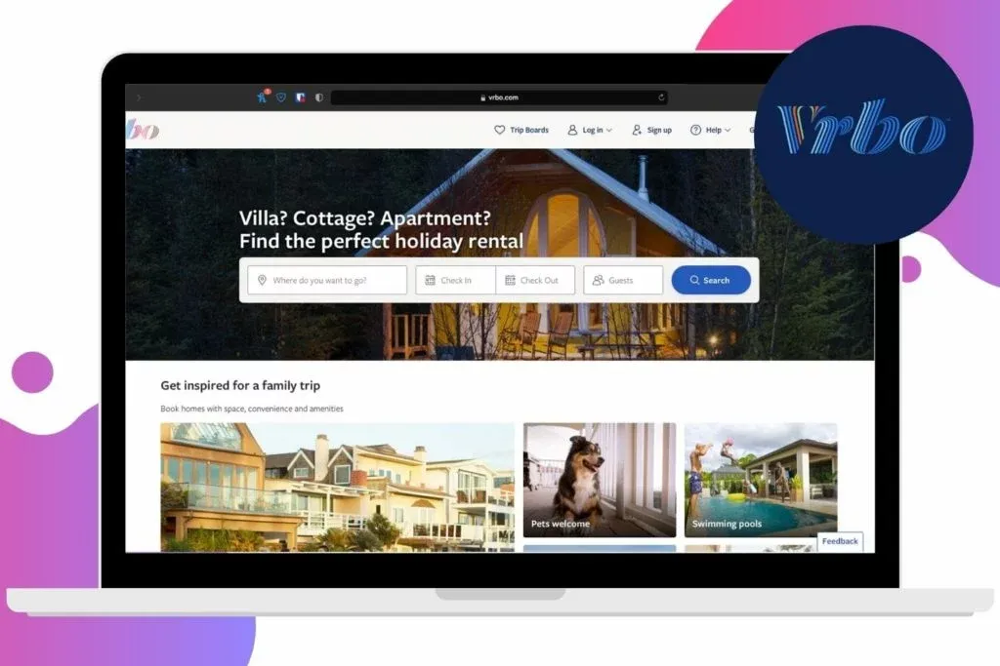
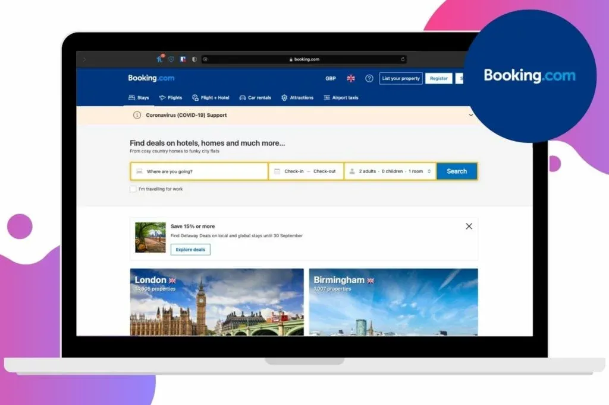
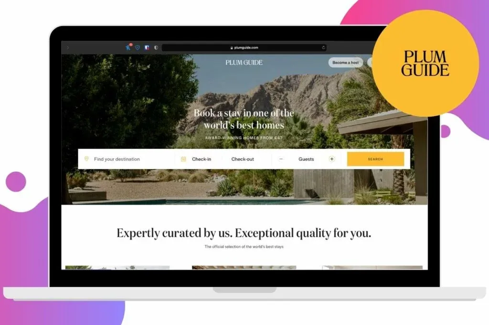
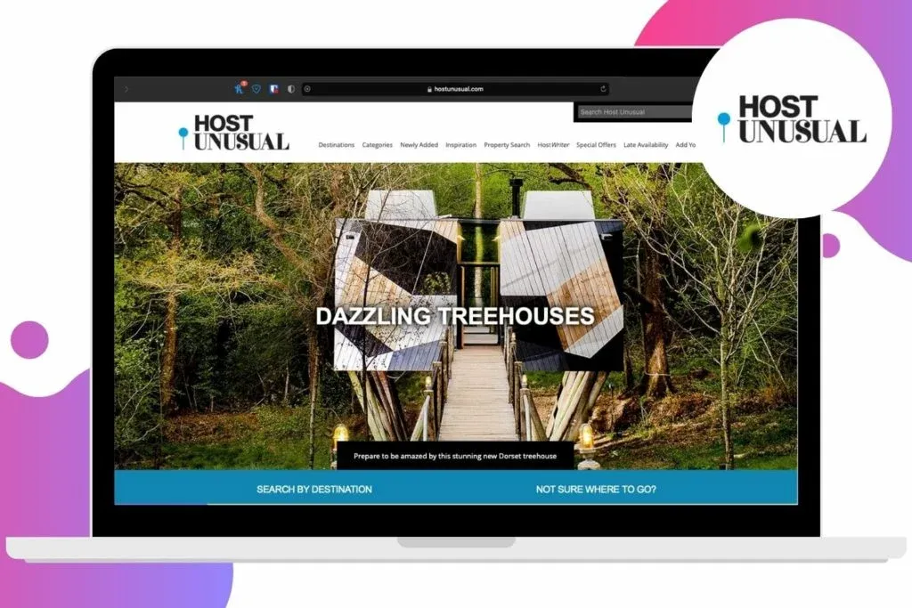
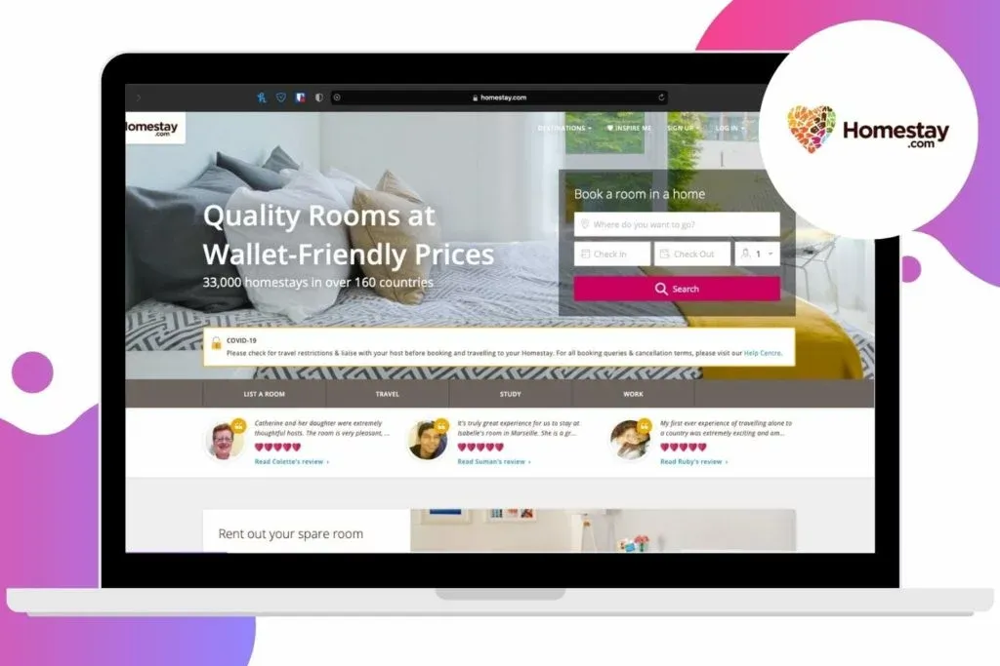
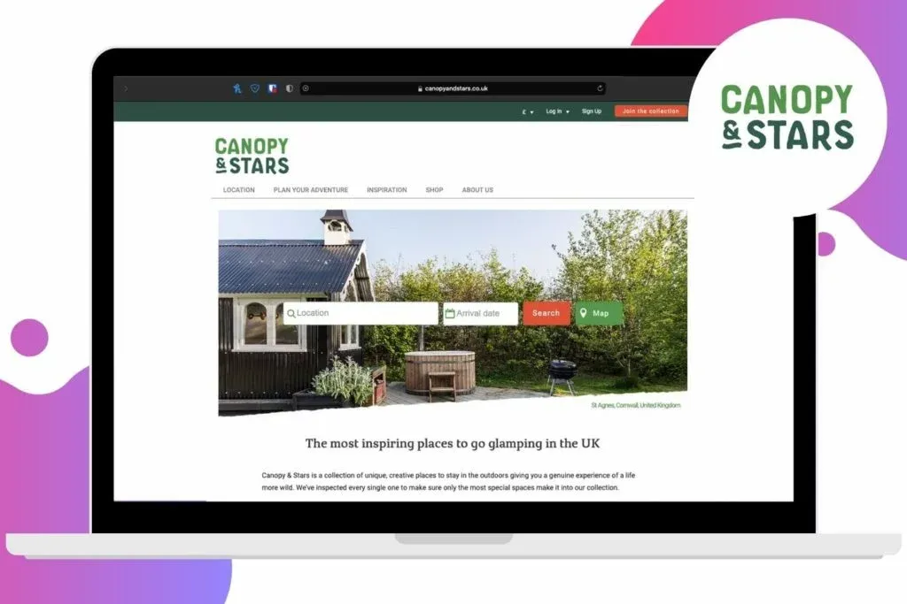

In this post, we aim to show you that there are alternatives to Airbnb. You just need to know where to look.

The slow and cautious reopening of tourism around the world has come at a time when most would be considering their options for holidays anyway. As such, there’s been quite a rush on available accommodation with many places in more popular destinations selling out fast.

For those seeking holiday homes and home rentals, Airbnb is the ubiquitous option for most (easily demonstrated by the word, ‘Airbnb’ now often being used as a moniker for, ‘holiday home’). As such, availability on Airbnb over the coming few months is running out.

Thankfully, there are alternatives to Airbnb that you can try out if you are having difficulty finding somewhere to stay. We’ve chosen a selection of these options for you and we present them to you below.

This post contains affiliate links. Find out more in our [Privacy Policy](https://giveback.guide/privacy).

## 6 of the best alternatives to Airbnb

Here the are our hand-selected alternatives to Airbnb, each offering something slightly different from one another. Whether you’re on a tight budget or you’re looking for a place to stay that’s completely out of the ordinary, hopefully one of these Airbnb alternatives is a good fit for you.

### Vrbo

Vrbo is currently on a big publicity push as it brings together several former brands (including HomeAway) under one umbrella. Owned by the Expedia Group, Vrbo boasts a database of 2 million rentals in 190 countries, all easily searchable in a very familiar-looking layout.

[Visit Vrbo](https://go.skimresources.com?id=85974X1563631&xs=1&url=https%3A%2F%2Fwww.vrbo.com%2Fen-gb%2Fholiday-rentals%2Funited-kingdom%2Fengland%2Fhertfordshire)

### Booking.com

The reigning king of hotel bookings also provides ready access to millions of holiday homes and rentals, which you can view by using the search filters or by heading to their dedicated landing pages.

[Visit Booking.com](https://go.skimresources.com?id=85974X1563631&xs=1&url=https%3A%2F%2Fwww.booking.com)

### Plum Guide

Whilst many of the accommodation booking sites fight it out over which has the most listings in their databases, Plum Guide is doing things a little differently. Rather than focusing on quantity, their focus is on quality. Using a stringent vetting system, Plum Guide, “don’t list a lot of homes \[…\] just the right ones.” As you might expect, prices are a little higher than on other sites, but you generally get what you pay for and it doesn’t mean there aren’t still bargains to be found.

[Visit Plum Guide](https://go.skimresources.com?id=85974X1563631&xs=1&url=https%3A%2F%2Fwww.plumguide.com)

### Host Unusual

If you’re the sort of person who’s open to staying overnight in a bubble, wigwam, tree tent, pod or yurt, you’re in luck. Host Unusual is a great place to start your search for accommodation. With places to stay all over the UK and around the world, some of the options listed here are truly mind-blowing.

[Visit Host Unusual](https://hostunusual.com)

### Homestay

Homestay appears to have moved into a gap in the market that Airbnb once occupied. Whilst Airbnb has been flexing its muscles, Homestay has been focusing on providing stays in real homes with real people. With options all over the world, Homestay is ideal for those on a budget and those looking to live like a local.

[Visit Homestay](https://go.skimresources.com?id=85974X1563631&xs=1&url=https%3A%2F%2Fwww.homestay.com)

### Canopy and Stars

For those looking to stay in the great outdoors, Canopy and Stars is a safe bet. Glamping is very much the main attraction here, with affordable and often luxurious places to stay all over Europe. Most of the places on offer provide all of the home comforts, with varying degrees of roughing it.

[Visit Canopy and Stars](https://www.canopyandstars.co.uk)

We hope you’ve found these Airbnb alternatives useful and that you’re able to use them to find somewhere to stay. We’ll keep our eyes pealed for more great alternatives and if we do, we’ll update this post.
